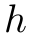
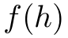
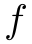
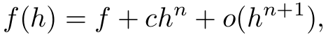
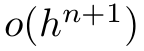
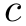
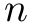

# richardson-extrapolation [](https://travis-ci.org/scijs/richardson-extrapolation) [](http://badge.fury.io/js/richardson-extrapolation) [](https://david-dm.org/scijs/richardson-extrapolation)

> Use Richardson Extrapolation sequence acceleration to compute the order of convergence and exact value of a sequence


## Introduction

[Richardson Extrapolation](https://en.wikipedia.org/wiki/Richardson_extrapolation) is a numerical method that uses solutions at multiple values of a small parameter  (think:  = grid size) to accelerate the converenge of a sequence. To make that concrete, consider an method  that computes an approximate value of the exact value . Writing this as <p align="center"></p> it's clear that, given a set of values of , the unknowns are the exact value  (approximate, with error term ), the error constant , and the order of convergence .

In its current form, this module solves for two of three parameters using the solution at two parameter sizes . So for example, given the the order of convergence , you may solve for the exact value  with error of order , or given the exact value , you may solve for the order of convergence .

The solution of all three unknowns requires the solution of a set of three nonlinear equations and is not implemented yet. :(

## Install

```bash
$ npm install richardson-extrapolation
```

## Example

```javascript
var richardson = require('richardson-extrapolation')

// Exact value = 3.5
// Order of convergence = 3
function func( h ) {
  return 3.5 + 2.0 * Math.pow( h, 3 )
}


// Solve for the order of convergence:
richardson( func, 1, { f: 3.5 } )
// => { f: 3.5,  n: 3,  c: 2 }


// Approximate the the exact value given order of convergence:
richardson( func, 1, { n: 3 } )
// => { f: 3.5,  n: 3,  c: 2 }
```


## API

### `require('richardson-extrapolation')( func, h, knowns )`
**Arguments:**
- `func`: a function that takes small parameter  as its only argument
- `h`: either a starting parameter size or a set of parameter sizes
  - if a number, then  is subdivided by a factor of 2 as needed t solve for the unknowns
  - if an array of numbers, then the first  are used as values of  in order solve for  unknowns

**Returns**: A hash containing three values: the approximated exact value , order of convergence , and the constant of the error term .

## TODO

Implement nonlinear simultaneous equation solver as a separate module in order to solve for all three unknowns.

## Credits

(c) 2015 Ricky Reusser. MIT License